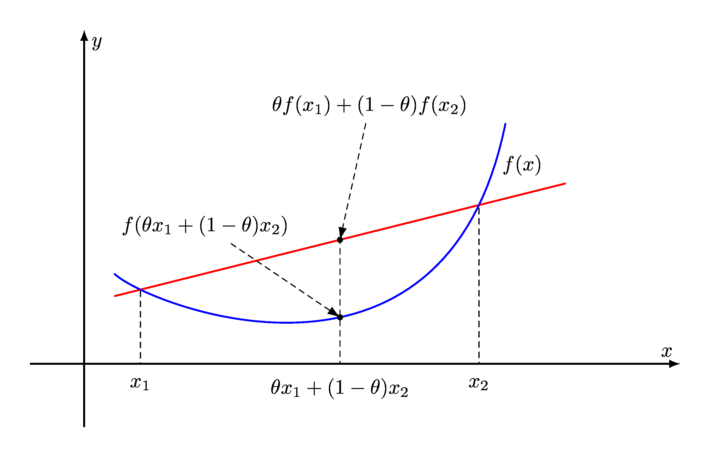

### Definition

<table>
<tr>
<td style="width: 60%;">

$f:R^n\to R$ is convex __if and only if__
* $\text{dom} f$ is convex
* $f\left(\theta x_1+(1-\theta)x_2\right)\leq\theta f(x_1)+(1-\theta)f(x_2), \forall x_1,x_2\in\text{dom}f$ and $0\leq\theta\leq1$ 
 
[(reference)](https://convex.indigits.com/convex_sets/convex_functions.html)

Notes:
1. Variants of Convex Functions:
   * _Strictly Convex_: if strict inequality whenever $x\ne y$ and $0<\theta<1$
   * _Concave_: if $-f$ is convex
   * _Strictly Concave_: if $-f$ is strictly convex
2. $\text{dom}f$ be convex is a must-have condition
   * e.g. $\frac{1}{x^2}$ is not a convex function since its domain is not convex because $0$ is not included in the domain

</td>
<td>

</td>
<tr>
</table>

