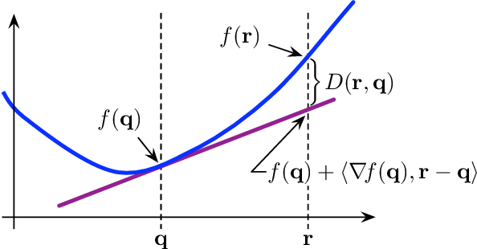

### First-Order Conditions

if $f$ is differentiable, then $f: R^n\to R$ is convex if and only if
* $\text{dom} f$ is convex
* $f(x_2)\geq f(x_1)+\nabla f(x_1)^T(x_2-x_1), \forall x_1,x_2\in\text{dom}f$

<!--  -->

---
Proof:

assume $x_1,x_2\in\text{dom}f, 0<\theta\leq1$
1. to prove necessity we have $f$ is differentiable and convex

$$
\begin{align*}
&f(\theta x_2+(1-\theta) x_1)\leq \theta f(x_2)+(1-\theta)f(x_1)\quad\textit{rearrange}\\
\Rightarrow&f(x_1+\theta(x_2-x_1))\leq (1-\theta)f(x_1)+\theta f(x_2)\quad\textit{divide both side by }\theta\\
\Rightarrow&f(x_2)\geq f(x_1)+\frac{f(x_1+\theta(x_2-x_1))-f(x_1)}{\theta}\\
\Rightarrow&f(x_2)\geq f(x_1)+\frac{f(x_1+\theta(x_2-x_1))-f(x_1)}{\theta(x_2-x_1)}(x_2-x_1)\\
\Rightarrow&f(x_2)\geq f(x_1)+f'(x_1)(x_2-x_1)\\
\end{align*}
$$

2. to prove sufficiency we assume $x^*=\theta x_1+(1-\theta)x_2$, therefore we can get 
  
$$
f(x_1)\geq f(x^*)+f'(x^*)(x_1-x^*),f(x_2)\geq f(x^*)+f'(x^*)(x_2-x^*)
$$ 

* Multiply first item by $\theta$ and second item by $1-\theta$. Adding them yields

$$
\theta f(x_1)+(1-\theta)f(x_2)\geq f(x^*)
$$