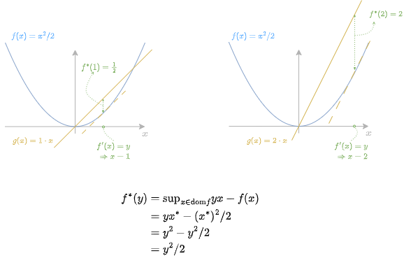
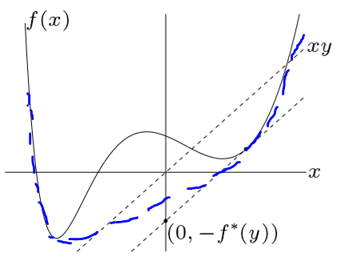

### Geometric Interpretations

<table>
<tr>
<td>

1. $f^*(y)$ is the **maximum gap** between linear function $yx$ and $f(x)$ 
   * for any $y$, the maximum gap occurs at the point $x$ where $f'(x)=y$ 
     * *$y$ is the slope. if get confused, think about $y$ as $\lambda$*
     * *visualize $yx$ as a rotating line crossing the origin*
     * *from Boyd, it is simple and direct but complex in giving a direct visualization*
     * an example of $f(x)=\frac{x^2}{2}$  ([ref1](https://freakonometrics.hypotheses.org/58979), [ref2](https://math.stackexchange.com/questions/1590045/is-frac12-x-2-the-only-function-that-is-equal-to-its-convex-conjugate)):
       * $df^*(y)/dx=y-x=0$, this means the maximum gap occurs at the point $x=y$ no matter what the value of $y$ is 

</td>
<td>

1.  $f^*(y)$ is the set of supporting hyperplanes
    * The point of the convex conjugate is to represent a function $f$
 as a set of tangent hyperplanes. [(ref)](https://math.stackexchange.com/a/3097458)
    * The parameters of all the tangent hyperplanes are encoded in the convex conjugate function $f^∗$
      * *visualize that starting from an feasible line crossing the origin, shift it down $f^*$ distance, it must become a supporting hyperplane of $f(x)$*
      * *from Bertsekas, it is indirect concept but it connects hyperplanes and original function*
      * example [(ref)](https://glooow.gitee.io/2020/03/04/optimization/ch6-conjugate-func/):

</td>
</tr>
</table>